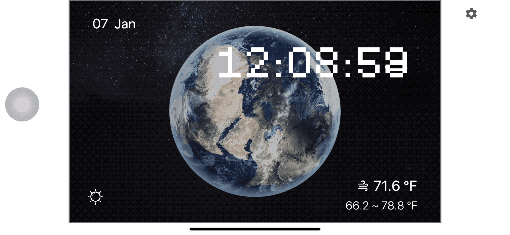

# Spirit Clock

**This work is made to participate in the [Flutter Clock](https://flutter.dev/clock) challenge.**

Use flutter to create a beautiful dial interface for Lenovo smart clock.
Works in line with the principles of visual beauty, novel concept and high code quality.

▼ **[ Feature Description: ]**

◉ Mosaic font effect used in the digital time part of the whole clock, with the middle of the number as the main axis to flip up and down to change the time.

◉ The middle of the dial is the rotating earth. This effect allows users to have a desire to keep looking at the clock, and the flashing stars and the meteors have added a touch of vitality to the cold dial.

◉ Users can choose the time presentation form through the clock（12-format/24-format）

◉ Today's weather conditions are displayed in the form of icons on the dial, and the current temperature, as well as today's high temperature and low temperature are displayed. There are two display forms, namely, Celsius (c) or Fahrenheit (f).

◉ The icon status in the lower left corner of the dial indicates the theme selected by the current clock.

📫If you have any questions and want to contact me, you can email me y_nan98@163.com

	

